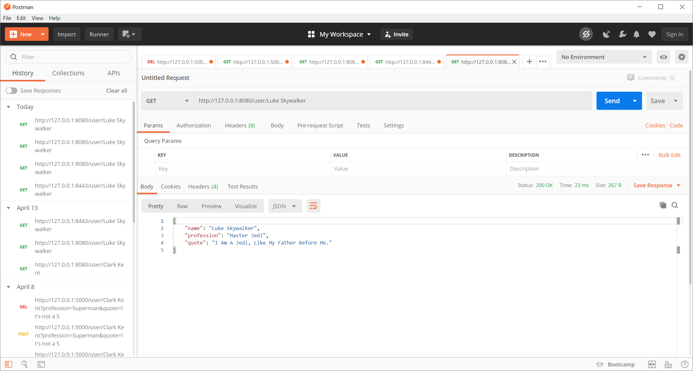
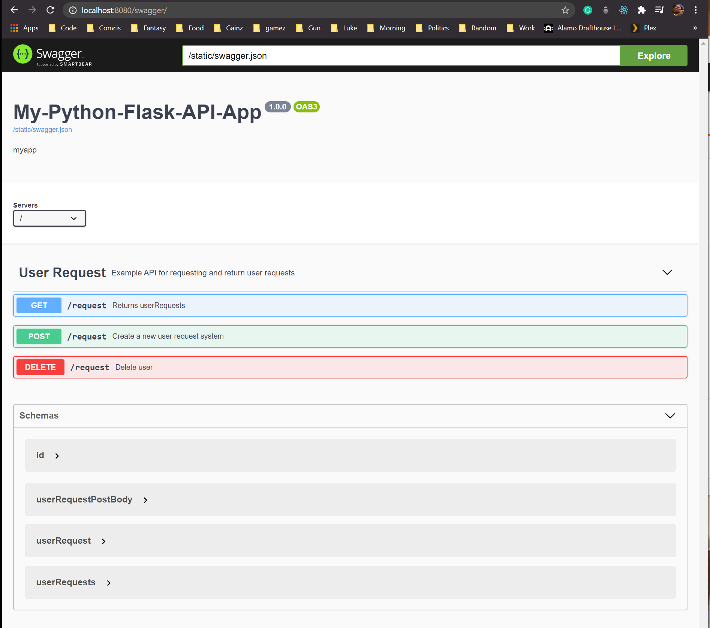

# Python3 flask API
> This is a simple REST API using Python.
>> A API tester such as a chrome extension or postman is required for testing.

## Requirements
* Python3
* Some sort of API testing tool.  I use Postman.

## Run Locally
1. cd to `/python_flask_api/myproject/venv/python_flask_api`
2. Run `python myapp.py`
3. Run API testing tool

## Swagger
> Note: If having issues with refreshing after making changes to swagger.json try clearing cache.

## Resource

https://medium.com/@sean_bradley/add-swagger-ui-to-your-python-flask-api-683bfbb32b36

https://pypi.org/project/flask-swagger/

https://django-rest-swagger.readthedocs.io/en/latest/
